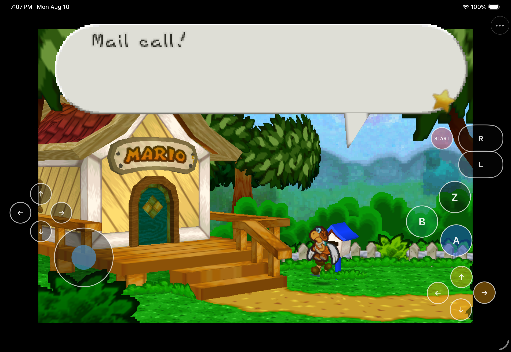
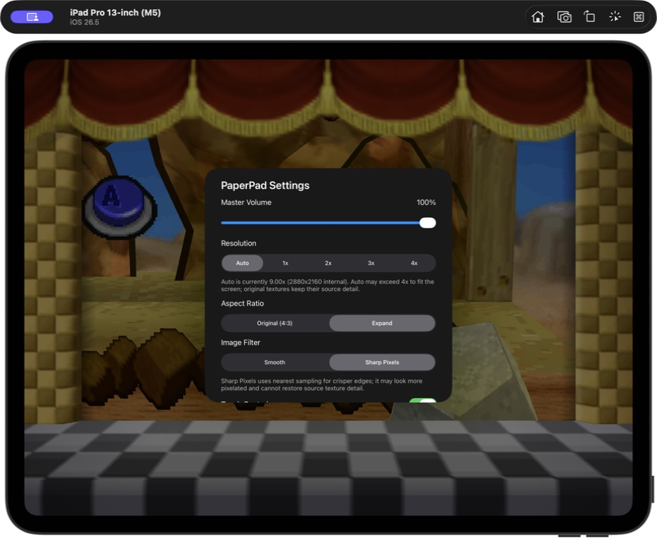
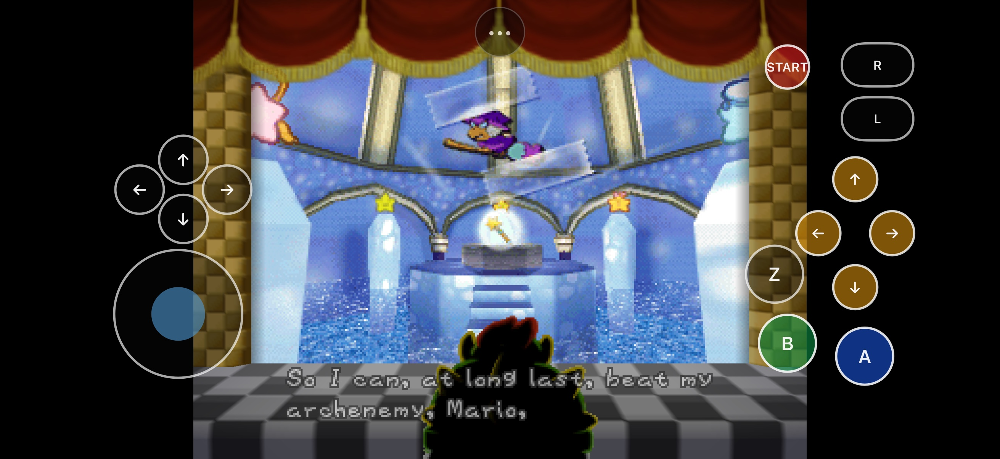

# PaperPad

<p align="center">
  
</p>

<p align="center">
  <strong>Paper Mario recompiled for Apple Silicon, with a native Metal renderer and an iPhone/iPad touch interface.</strong>
</p>

<p align="center">
  
  
  
  
  
</p>



PaperPad combines the [pmret Paper Mario decompilation](https://github.com/pmret/papermario) with the statically recompiled runtime and renderer vendored by [Paper-Mario-ReCut](https://github.com/SMCGames/Paper-Mario-ReCut). It adds an Apple application shell, Metal presentation, keyboard/controller input, a safe-area-aware touch layout, native settings, and a private first-run ROM importer.

This repository contains integration source, patches, scripts, and documentation. It does **not** contain Paper Mario, a ROM, extracted Nintendo assets, generated playable game code, saves, or a playable ROM-derived archive. You must supply your own legally obtained supported game data locally. Read [RIGHTS_AND_LICENSES.md](RIGHTS_AND_LICENSES.md) before redistributing any source or binary.

## Availability

There are currently no signed, notarized, TestFlight, App Store, or prebuilt public downloads. The table describes source builds verified from this repository through 2026-08-11.

| Target | Status | Acceptance exercised |
|---|---|---|
| Apple Silicon macOS | **Verified source build** | Clean app build, launch, intro, file creation, and early gameplay |
| iPhone Simulator | **Current source build verified** | Current audio telemetry, live Auto status, diagnostics/modal restoration, compact landscape framing, and earlier touch-driven title/file flow plus 1x–4x evidence |
| iPad Simulator | **Current source build verified** | Stateful audio conversion, crash-log rotation, live Auto status, first-level diagnostics, modal touch restoration, borderless Retina framing, and the previously verified opening route |
| Physical iPad | **Corrected iteration installed; release blocked on progression and audio** | The signed 2026-08-11 replacement installed and launched in place on an iPad Pro 12.9-inch (6th generation), iPadOS 26.5.2, preserving the exact merged save. Hands-on testing then encountered a Goomba Village gate-unlock freeze that left Mario input-locked and NPCs idle. Audible synthesis crackle also remains release-blocking |
| Physical iPhone | **Not yet verified** | No current signed build, install, or on-device playtest evidence |
| TestFlight / App Store | **Not announced** | Distribution rights, signing, packaging, and store review remain outside the verified scope |

An iPad-only follow-up on 2026-08-10 reproduced the reported File 1A crash,
transition shudder, and clipped-audio conditions. The retained renderer fix
removed runaway Simulator Metal allocation growth and kept File 1A through
Mario's House stable at 4x. On 2026-08-11, a bounded PCM comparison isolated a
second audio defect: the block-by-block resampler introduced high-frequency
energy and discontinuities that were absent from the emulator source. PaperPad
now uses a continuous SDL audio stream; captured Simulator output matches the
source spectrum. The installed physical build also logged 190 structural audio
windows with a 60.75 ms maximum queue and no conversion, queue, or over-100 ms
event. Hands-on listening subsequently confirmed that a smaller audible
crackle remains. That separates the fixed host resampler defect from the open
HLE N64 sound-synthesis defect; it is not evidence that the audio is
release-ready.

PaperPad is a source release candidate, not a claim that every chapter or physical-device configuration has completed acceptance. A prior physical-iPad build exposed the audio/control issues tracked here. The signed 2026-08-11 fixes are now installed and running on that iPad, but installation/process evidence does not replace hands-on audible, touch, visual, or lifecycle acceptance. See [docs/STATUS.md](docs/STATUS.md) and [docs/RELEASE_CHECKLIST.md](docs/RELEASE_CHECKLIST.md) for the exact boundary.

## Get started

### Requirements

- Apple Silicon Mac
- Xcode with the macOS and iOS Simulator SDKs
- CMake, Ninja, Git, jq, Python 3.11 or newer, Rust/Cargo, and Homebrew
- GNU `cpp-16` (`brew install gcc`); the setup script builds the required MIPS binutils if necessary
- A legally obtained, unmodified Paper Mario (US) 1.0 ROM in `.z64`, `.v64`, or `.n64` byte order
- Several gigabytes of free space for pinned sources, the decompilation build, generated AOT source, and build trees

The supported ROM normalizes to 40 MiB and SHA-1 `3837f44cda784b466c9a2d99df70d77c322b97a0`. That identifier validates compatibility; it is not a download hint.

### macOS

From the repository root:

```sh
scripts/build-macos-app.sh --rom /absolute/path/to/your/paper-mario-rom
open build-macos-release/PaperPad.app
```

The first command fetches exact source pins, applies maintained patches, validates and normalizes the ROM, builds the decompilation and host tools, generates local AOT source, builds PaperPad, and ad-hoc signs the ROM-free app. Generated input stays in ignored local directories.

After the first successful generation, an incremental rebuild can omit `--rom`:

```sh
scripts/build-macos-app.sh
```

The macOS app reads the private normalized ROM from the local generated workspace; it is not copied into `PaperPad.app`.

### iPhone or iPad Simulator

Build the Simulator app, boot exactly one Simulator, then install it:

```sh
scripts/build-ios-simulator.sh --rom /absolute/path/to/your/paper-mario-rom
xcrun simctl list devices available
xcrun simctl boot "iPad Pro 11-inch (M4)"
open -a Simulator
xcrun simctl install booted build-ios-simulator/Release/PaperPad.app
xcrun simctl launch booted com.chrissotraidis.paperpad
```

On first launch, choose your own ROM through the native document picker. PaperPad accepts the three standard N64 byte orders, verifies the exact revision, normalizes it, and stores the private copy in that simulated device's Application Support container. The built `.app` itself remains ROM-free.

To avoid ambiguous tests, shut down the active Simulator before testing another app or target:

```sh
xcrun simctl terminate booted com.chrissotraidis.paperpad || true
xcrun simctl shutdown booted
```

See [docs/BUILDING.md](docs/BUILDING.md) for clean-build details and troubleshooting.

## Controls

### macOS keyboard

| N64 input | Keyboard | N64 input | Keyboard |
|---|---|---|---|
| A | `Z` | B | `X` |
| Start | Return | Z | Left Shift |
| L / R | `Q` / `E` | Analog stick | Arrow keys |
| D-pad | `W` `A` `S` `D` | C-buttons | `I` `J` `K` `L` |

SDL-compatible controllers use the left stick, D-pad, face buttons, shoulders, left trigger for Z, and right stick for the C-buttons.

### iPhone and iPad touch

The overlay provides an analog stick, D-pad, A/B/Z, C-buttons, L/R, and Start. `PaperPad Menu` remains accessible above gameplay and opens:

- master volume;
- Automatic, 1x, 2x, 3x, or 4x internal rendering resolution;
- Original (4:3) or Fill Screen framing;
- touch-control visibility and opacity;
- touch-layout editing and reset;
- live renderer-confirmed scale/internal dimensions for the selected resolution;
- first-level and Settings access to a privacy-bounded diagnostics report with current and previous-session logs; and
- private ROM replacement/removal.

Touch visibility, opacity, layout, resolution, aspect ratio, and volume persist locally. Auto may report a scale above the manual 4x ceiling because it selects the largest integer scale that fits the current screen. Original preserves centered 4:3 framing. Fill Screen center-crops the completed 4:3 presentation, so actors and game HUD remain in the same coordinate system; it can crop image edges, especially on wider displays. Smooth filtering is fixed. The physically rejected Crisp 2D experiment was removed because it made the image harsher without reconstructing missing glyph or texture detail.
Opening PaperPad's menu, Settings, share sheet, or ROM sheet clears held input and hides every gameplay touch target until dismissal. `Share Diagnostics & Logs…` creates a text report with app, system, screen, settings, and renderer-confirmed resolution metadata; whether a supported-size ROM is installed; and at most the last 512 KiB of both the current and previous runtime logs. A leftover session marker makes a possible-crash log appear first after relaunch. Each private log is capped at 4 MiB. The report never attaches ROM or save contents. Known app-container, home, and temporary paths are replaced, but runtime text is not guaranteed to be anonymous: review it before choosing a share destination.

The phone/tablet layout, persistent menu, modal input lifecycle, and customization model are adapted from [HarkinianPad](https://github.com/chrissotraidis/harkinianpad). PaperPad keeps its own direct N64 input bridge and does not claim feature parity. The installed iOS build hides gameplay touch controls while a hardware controller is connected and restores them on disconnect; physical controller acceptance remains open.

## What works

- Static arm64 game code; no JIT or downloaded executable code on Apple targets
- Direct Metal rendering through the ReCut-vendored RT64 and N64ModernRuntime trees
- HLE NAUDIO processing through pinned `mupen64plus-rsp-hle`
- Keyboard and SDL controller input on macOS
- Multi-touch N64 controls, a fixed/clamped visible stick with a broad pickup area, a precision response curve with cardinal-direction bias, layout editing, opacity, and enable/disable controls on iPhone/iPad
- iPhone and iPad native-window support with Retina pixel sizing, safe-area layout, rotation recovery, and original-aspect framing
- Native first-run ROM selection, byte-order normalization, exact revision validation, private storage, and ROM management
- Flash save handling and clean RT64 worker teardown fixes maintained as source patches
- Ordered Apple shutdown: renderer/events/saves finish before a clean single-session process exit, avoiding parked guest-thread teardown races

## Current limits

- The current physical-iPad development build passes signing, in-place install, launch, and live-process checks, but the Goomba Village gate-unlock sequence can leave Mario input-locked while NPCs remain idle. This P0 progression failure must be reproduced and fixed before the exercised route is considered playable. The continuous resampler removed one measured conversion defect, but audible crackle also remains in the HLE N64 sound-synthesis path. Physical iPhone remains untested.
- The current playtest covers the opening flow and early gameplay, not a complete game playthrough.
- Controller-driven touch auto-hide is implemented but not yet accepted on physical hardware. PaperPad does not yet implement HarkinianPad's hold-to-latch Z gesture.
- The persistent menu and native setup/settings controls are accessibility-labeled; the custom-drawn gameplay buttons are not yet exposed as individual VoiceOver elements.
- The iOS launch log can report an unbalanced UIKit appearance-transition warning, and Simulator can report a duplicate accessibility-class warning. Neither blocked the verified session, but both remain cleanup items.
- RT64 logs `RenderPool in Metal is not implemented currently`; the tested rendering path continues without a crash.
- Internal resolution improves geometry edges and sampling but cannot recreate detail in original low-resolution text, sprites, or textures. PaperPad uses RT64's stable smooth path; its removed Crisp 2D experiment made those source assets look worse. RT64 supports user-supplied texture replacement in principle, but PaperPad does not ship, endorse, or validate a Paper Mario HD pack, and no third-party game assets are bundled.

Report a reproducible regression with the platform, device/OS, PaperPad commit, build command, expected and actual behavior, and non-sensitive logs. Never attach or request ROMs, extracted assets, saves, signing files, or credentials.

## Frequently asked questions

<details>
<summary><strong>Does PaperPad include Paper Mario?</strong></summary>

No. PaperPad is ROM-free and accepts only a user-supplied, legally obtained Paper Mario (US) 1.0 ROM with the documented fingerprint. It is a game-specific static recompile, not a general N64 emulator.
</details>

<details>
<summary><strong>Are physical iPhone and iPad builds verified?</strong></summary>

Partially. A ROM/save-free development build containing the current 2026-08-11 iteration was signed, installed in place, launched, and observed running on an iPad Pro 12.9-inch (6th generation) running iPadOS 26.5.2. Simulator checks and process evidence cover the implementation path, but the current device build still requires hands-on listening, touch, visual, and lifecycle acceptance. Physical iPhone remains unverified.
</details>

<details>
<summary><strong>What is the controller and audio boundary?</strong></summary>

macOS and iOS map SDL-compatible controllers, and the iOS build hides the touch overlay while a controller is connected. PaperPad's HLE audio path reaches the runtime audio queue. Audible output, interruptions, controller mapping/hot-plug, and overlay restoration still require physical iPhone/iPad acceptance.
</details>

<details>
<summary><strong>How should I report a problem?</strong></summary>

Open `PaperPad Menu` → `Share Diagnostics & Logs…`, review the generated text, and attach it only if it contains nothing private. After a suspected crash, relaunch once and the report places the bounded previous-session log first. Include exact reproduction steps and a screenshot when the issue is visual. See [CONTRIBUTING.md](CONTRIBUTING.md).
</details>

## Visual verification

The public page keeps only the strongest current captures; the larger engineering set remains in [`docs/release-audit/`](docs/release-audit/).

| Last accepted iPad Settings baseline | Current iPhone touch layout |
|---|---|
|  |  |

Archived comparison references include [Nintendo's file-select guide](https://www.nintendo.co.jp/wii/vc/vc_ms/vc_ms_03.html) and [Nintendo's early-game guide](https://www.nintendo.co.jp/wii/vc/vc_ms/vc_ms_01.html). These support composition/palette review; they do not claim pixel-identical rendering.

## Reproducibility and repository safety

`dependencies.lock.json` records every fetched source revision and the supported ROM fingerprint. `scripts/clone-sources.sh` checks out those exact revisions under ignored `ref/`, disables their push URLs, and `scripts/apply-patches.sh` applies the maintained patch series idempotently.

Before publishing source, run:

```sh
scripts/check-repo-safety.sh
git diff --check
```

The safety audit rejects game data, generated packages, signing material, likely credentials, tracked reference checkouts, and oversized files from both the current tree and publishable Git history. It also validates shell syntax, executable bits, and Git integrity.

## Project map

| Path | Purpose |
|---|---|
| `apple/app/` | UIKit lifecycle, setup/ROM manager, settings, touch UI, privacy manifest, and app metadata |
| `src/` | Native runner, input, renderer bridge, runtime hooks, paths, and generated-code integration |
| `config/` | N64Recomp configuration template |
| `patches/` | Ordered fixes for pinned ReCut, N64ModernRuntime, N64Recomp, and RT64 source |
| `scripts/` | Fetch, validate, generate, build, test-support, and repository-audit automation |
| `docs/` | Architecture, build, status, testing, dependency, issue, and release documentation |
| `ref/` | Ignored pinned source inputs; never published |
| `generated/` | Ignored ROM-derived/AOT build input; never published |

## Documentation

- [Architecture](docs/ARCHITECTURE.md)
- [Building](docs/BUILDING.md)
- [Current status](docs/STATUS.md)
- [Testing history](docs/TESTING.md)
- [2026-08-10 Simulator validation](docs/VALIDATION-2026-08-10.md)
- [Known issues](docs/KNOWN-ISSUES.md)
- [Dependency inventory](docs/DEPENDENCIES.md)
- [Repository inventory](docs/REPOSITORY-INVENTORY.md)
- [Release checklist](docs/RELEASE_CHECKLIST.md)
- [Contributing](CONTRIBUTING.md)
- [Security policy](SECURITY.md)
- [Rights and licensing boundary](RIGHTS_AND_LICENSES.md)

## Legal and acknowledgements

PaperPad is an independent, unofficial project and is not affiliated with or endorsed by Nintendo. Paper Mario and all related game names, characters, copyrights, and trademarks belong to their respective owners. pmret, SMCGames, N64Recomp/N64ModernRuntime, RT64, mupen64plus, SDL, zstd, and their contributors retain their own licenses and rights. See [RIGHTS_AND_LICENSES.md](RIGHTS_AND_LICENSES.md) and [docs/DEPENDENCIES.md](docs/DEPENDENCIES.md); neither is legal advice.
