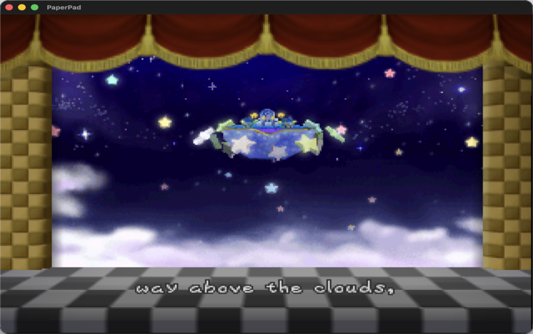

# PaperPad

  <strong>Paper Mario on macOS, iPhone, and iPad—with touch controls built for
  turn-based adventure.</strong> 
  Native Metal rendering, a Paper Mario touch layout, safe-area aware controls,
  and the full pmret decompilation recompiled for Apple platforms.

  
  
  
  
  

PaperPad brings the full
[pmret/papermario](https://github.com/pmret/papermario) decompilation of Paper
Mario (N64, US 1.0) to macOS, iPhone, and iPadOS. It recompiles the game's
source to native code, renders with Metal through the mstan RT64 fork, and
adds a touch layout tuned for Paper Mario: a stick for movement, D-pad for
menus and battles, and face/shoulder buttons placed for adventure play rather
than racing.

This repository contains the Apple integration, build scripts, and
documentation. It does **not** contain Paper Mario, a ROM, extractable or
playable Nintendo game assets, or a playable ROM-derived archive. The game
ROM stays on your machine and is never committed. See
`docs/ARCHITECTURE.md` for the dependency graph and `docs/RESEARCH.md` for the
ROM and asset boundary notes.

## Status

- **macOS**: plays through the intro, opening narration, and into Toad Town
  gameplay at ~60fps with keyboard controls; HLE audio backend (no RSP
  flood). Evidence in `docs/evidence/`.
- **iPhone Simulator**: same progression with the Paper Mario touch overlay
  (stick, D-pad, A/B/Z, C-buttons, L/R, START); verified stable 10+ minutes.
- **iPad Simulator**: runs the intro with the touch overlay; a native-mode
  fix (device family 1,2) is built — see `docs/STATUS.md` for the current
  target-by-target status, `docs/KNOWN-ISSUES.md` for known issues, and
  `docs/HANDOFF.md` for the handoff.
- Physical-device signing remains an external boundary (no signing identity
  or device in this environment).

## Controls

- **macOS**: Z=A, X=B, Enter=Start, arrows=stick, WASD=D-pad.
- **iOS/iPadOS**: on-screen stick, D-pad, A/B/Z, C-buttons, L/R, and Start,
  laid out for one- or two-thumb play with safe-area insets respected.

## Building and running

Everything is documented in `docs/BUILDING.md` (prerequisites, toolchain,
ROM expectations, per-target commands) and `docs/HANDOFF.md` (current state,
next task, reproduce steps). The short version: decompile, generate AOT
source, then build the macOS runner or the iOS Simulator app via CMake/Xcode.

## Documentation

- `docs/ARCHITECTURE.md` - reference repos, dependencies, reused components
- `docs/BUILDING.md` - prerequisites, tools, commands, ROM expectations
- `docs/STATUS.md` - target-by-target status
- `docs/TESTING.md` - dated test evidence, commands, logs, screenshots
- `docs/KNOWN-ISSUES.md` - known issues, failed approaches, open decisions
- `docs/HANDOFF.md` - what works, what does not, next highest-priority task
