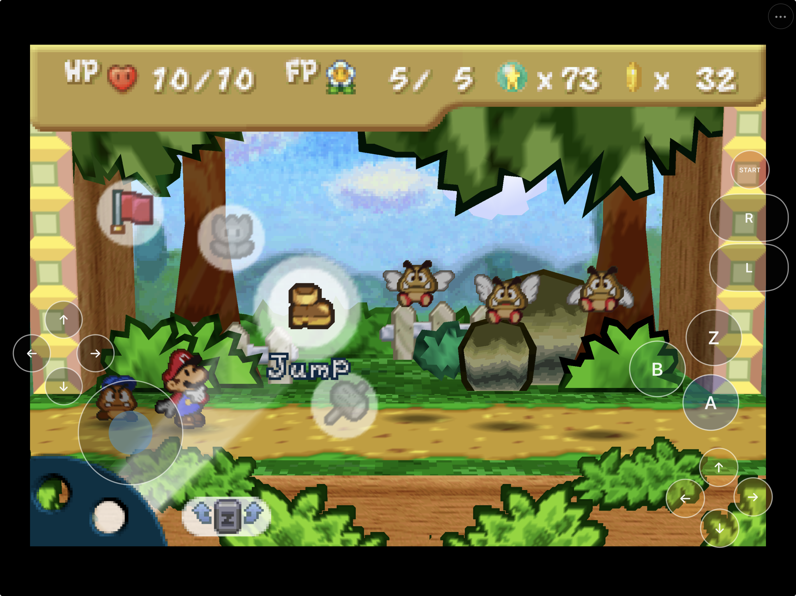
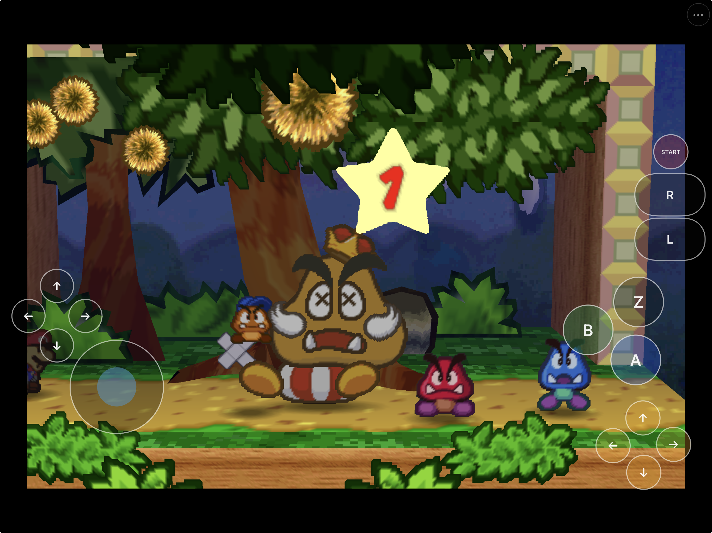
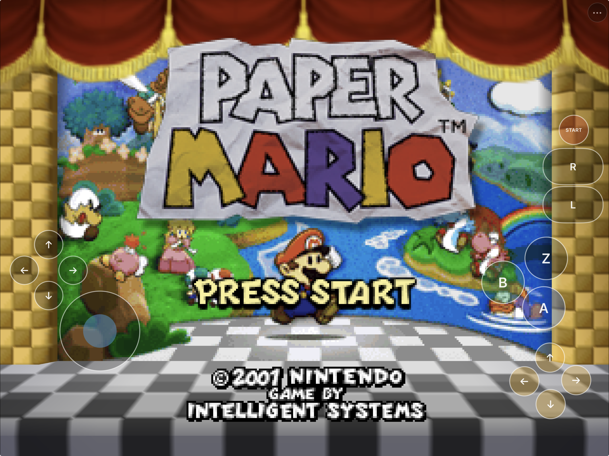
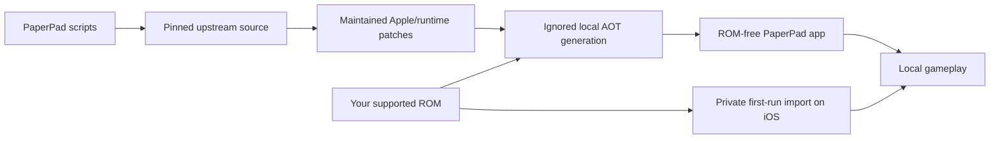

# PaperPad



<p align="center">
  <strong>Paper Mario recompiled for Apple Silicon.</strong><br>
  Native Metal rendering, customizable iPhone and iPad controls, controller support, and private ROM import.
</p>

<p align="center">
  
  
  
  
  
</p>

PaperPad combines the [pmret Paper Mario decompilation](https://github.com/pmret/papermario) with the statically recompiled runtime and renderer maintained by [Paper-Mario-ReCut](https://github.com/SMCGames/Paper-Mario-ReCut). It adds a native Apple application shell, Metal presentation, keyboard and controller input, customizable touch controls, native settings, and private first-run ROM import.

PaperPad is a game-specific static recompile, not a general Nintendo 64 emulator. It currently supports only an unmodified **Paper Mario (US) 1.0** ROM supplied by the user.

This repository contains integration source, patches, scripts, and documentation. It does **not** contain Paper Mario, a ROM, extracted Nintendo assets, generated playable game code, saves, or a playable ROM-derived archive. Read the [rights and licensing boundary](RIGHTS_AND_LICENSES.md) before redistributing source or a build.

## Project status

PaperPad `v0.1.0-preview.1` is the first public iPhone and iPad preview. The release provides a ROM-free, unsigned IPA that users sign with their own Apple credentials. There is no TestFlight, App Store release, signed download, or notarized macOS build.

| Target | Current status |
|---|---|
| Apple Silicon macOS | Source build, launch, file creation, early gameplay, keyboard input, and clean quit verified |
| iPhone Simulator | Current development build and compact touch layout verified |
| iPad Simulator | Current development build, touch/settings flows, diagnostics, and later-game fixture verified |
| Physical iPad | Installed and actively tested; battle cursor, first-Goomba battle, longer controller play, and one clean replay of the intermittent early progression route verified |
| Physical iPhone | Current clean build installed and launched; private test ROM/save migrated, with hands-on touch and gameplay acceptance open |
| Public binary distribution | [ROM-free unsigned Preview 1](https://github.com/chrissotraidis/paperpad/releases/tag/v0.1.0-preview.1); self-signing required |

Current device testing covers early battles, a 16-minute Kishi V2 session, and one clean instrumented replay of the intermittently delayed Goompa return route. Two more targeted progression replays, longer listening, complete controller mapping/reconnect, physical-iPhone hands-on acceptance, and chapter-spanning testing remain before PaperPad should be described as stable.

See [Current status](docs/STATUS.md), [Technical debt](docs/TECH-DEBT.md), and the [Release checklist](docs/RELEASE_CHECKLIST.md) for dated evidence and the remaining gates.

## Download Preview 1

Download `PaperPad-v0.1.0-preview.1-unsigned.ipa` and its checksum from the [Preview 1 release](https://github.com/chrissotraidis/paperpad/releases/tag/v0.1.0-preview.1).

- iPhone or iPad with iOS/iPadOS 15 or newer
- arm64, ROM-free, and unsigned; sign it with your own Apple credentials
- SHA-256: `03a4b1006dbfc91ec8abb849df5c59b49145a5feb215b179ff1da10001848045`
- Paper Mario (US) 1.0 must be supplied and imported by the user

Follow the [unsigned IPA installation guide](docs/INSTALL_IPA.md). Preview 1 is not an App Store or TestFlight build; uninstalling can remove the private ROM, saves, and settings stored by your signed copy.

## Get started

### Requirements

- An Apple Silicon Mac
- Xcode with the macOS and iOS SDKs
- Homebrew
- CMake, Ninja, Git, jq, Python 3.11 or newer, and Rust/Cargo
- GNU `cpp-16` (`brew install gcc`)
- Several gigabytes of free build space
- Your own legally obtained, unmodified Paper Mario (US) 1.0 ROM

PaperPad accepts `.z64`, `.v64`, and `.n64` byte orders. The supported ROM normalizes to 40 MiB with SHA-1 `3837f44cda784b466c9a2d99df70d77c322b97a0`. This fingerprint verifies compatibility; it is not a download hint.

Clone the repository:

```sh
git clone https://github.com/chrissotraidis/paperpad.git
cd paperpad
```

### macOS

```sh
scripts/build-macos-app.sh --rom /absolute/path/to/your/paper-mario-rom
open build-macos-release/PaperPad.app
```

The build fetches pinned source, applies the maintained patches, validates the ROM, generates local AOT game code, builds PaperPad, and ad-hoc signs a ROM-free app. After the first successful generation, incremental builds can run without `--rom`:

```sh
scripts/build-macos-app.sh
```

The macOS app reads the normalized ROM from the ignored local workspace. It is not copied into `PaperPad.app`.

### iPhone or iPad Simulator

Build the app, boot **one Simulator at a time**, then install and launch it:

```sh
scripts/build-ios-simulator.sh --rom /absolute/path/to/your/paper-mario-rom
xcrun simctl list devices available
xcrun simctl boot "iPad Pro 11-inch (M4)"
open -a Simulator
xcrun simctl install booted build-ios-simulator/Release/PaperPad.app
xcrun simctl launch booted com.chrissotraidis.paperpad
```

On first launch, select your ROM through the native document picker. PaperPad validates the exact revision, normalizes its byte order, and stores the private copy in that Simulator's Application Support container. The installed `.app` remains ROM-free.

Shut down the active Simulator before switching device classes:

```sh
xcrun simctl terminate booted com.chrissotraidis.paperpad || true
xcrun simctl shutdown booted
```

Physical iPhone and iPad builds require your own Apple development team and provisioning profile. Follow the [device build and in-place installation guide](docs/BUILDING.md#physical-iphone-or-ipad-development-build); never uninstall an existing copy merely to update it if its private ROM, saves, or settings must be preserved.

## First launch

PaperPad never downloads game data.

1. Launch the iPhone, iPad, or Simulator app.
2. Choose **Choose ROM**.
3. Select your own supported dump in Files.
4. Wait for validation and private normalization to complete.
5. Start the game with the on-screen Start button or a connected input device.

Use **PaperPad Menu → Settings → Manage Game ROM** to replace or remove the private copy later. ROM and save contents are never included in shared diagnostics.

## Touch controls and settings

PaperPad provides every standard N64 input on screen: analog stick, D-pad, A, B, Z, C-buttons, L, R, and Start. Phone and tablet layouts are independent, persist locally, and can be moved or reset from Settings.

- **Menu:** the persistent `•••` button opens PaperPad settings and support actions.
- **Touch controls:** show or hide the gameplay overlay and adjust its opacity.
- **Layout editor:** move controls without snapping their centers to the initial touch point. D-pad and C buttons move individually by default; select one and choose **Link** to move that four-button cluster together, or **Unlink** to return to individual placement. Reset restores the current device-class defaults.
- **Resolution:** choose Auto, 1x, 2x, 3x, or 4x internal rendering. Auto reports its current renderer-confirmed scale and dimensions and may exceed 4x when the display permits it.
- **Framing:** Original preserves the largest centered 4:3 presentation. Fill Screen center-crops that presentation and may crop image edges on wider displays.
- **Volume:** adjust and persist master output volume.
- **Diagnostics:** create a reviewable text report through the system share sheet.
- **ROM management:** replace or remove the privately stored game ROM.

Opening the menu, Settings, share sheet, or ROM picker clears held input and hides gameplay touch targets. Dismissing the sheet restores them only when Touch Controls is enabled. When a hardware controller is connected, the iOS build hides the gameplay overlay while keeping the menu available, then restores touch controls on disconnect; basic physical-controller play is verified, while reconnect and complete mapping acceptance remain open.

### Keyboard and controller bindings

| N64 input | macOS keyboard | N64 input | macOS keyboard |
|---|---|---|---|
| A | `Z` | B | `X` |
| Start | Return | Z | Left Shift |
| L / R | `Q` / `E` | Analog stick | Arrow keys |
| D-pad | `W` `A` `S` `D` | C-buttons | `I` `J` `K` `L` |

SDL-compatible controllers use the left stick, D-pad, face buttons, shoulders, left trigger for Z, and right stick for the C-buttons. A physical Kishi V2 session verified analog plus A/B/Z/L/R/Start during sustained play. D-pad, all C directions, hot-plug, and reconnect still require targeted acceptance.

## Screenshots

<table>
  <tr>
    <td width="50%">
      
    </td>
    <td width="50%">
      
    </td>
  </tr>
  <tr>
    <td align="center"><strong>Battle gameplay</strong><br>Native Metal presentation with the complete touch interface.</td>
    <td align="center"><strong>Paper Mario on iPad</strong><br>Original 4:3 presentation with customizable controls.</td>
  </tr>
</table>

## What works

| Area | Current implementation |
|---|---|
| Native code | Static arm64 game code on Apple targets; no JIT or downloaded executable code |
| Rendering | RT64 presentation through Metal with Retina drawable sizing |
| Game setup | Native ROM selection, three-byte-order normalization, exact revision validation, and private storage |
| Touch | Full N64 overlay, multi-touch, fixed/clamped analog knob, opacity, independent phone/tablet layouts, editing, and reset |
| Display | Auto and fixed 1x–4x internal scales; original 4:3 and center-cropped Fill Screen modes |
| Input | macOS keyboard/controller support and iOS SDL controller mappings |
| Saves | Flash-save handling plus in-place device updates that preserve the app container |
| Support | First-level diagnostics action, bounded current/previous logs, session marker, and system share sheet |
| Repository safety | Pinned dependencies, maintained patch replay, and ROM/signing/private-data publication checks |

Internal resolution improves geometry edges and sampling, but it cannot reconstruct detail absent from the original low-resolution text, sprites, or textures. PaperPad uses RT64's stable smooth path and does not ship or endorse a third-party texture pack.

## Supported game

| Game | Revision | Status |
|---|---|---|
| **Paper Mario** | US 1.0 | Supported input for local builds and runtime import |
| Paper Mario | Japan, PAL, iQue, modified/randomized ROMs | Not supported by the current configuration |
| Other Nintendo 64 games | Any | Not supported; PaperPad is not a general emulator |

## Diagnostics and bug reports

Open **PaperPad Menu → Share Diagnostics & Logs…** after reproducing a problem. The generated report includes:

- app/build, system, screen, settings, and renderer-confirmed resolution metadata;
- only whether a supported-size ROM is present, never its contents;
- at most the last 512 KiB of the current and previous runtime logs; and
- a possible-unclean-session label when the previous run did not remove its private session marker.

Each private log is capped at 4 MiB. Known app-container, home, and temporary paths are replaced, but arbitrary runtime text is **not guaranteed to be anonymous**. Review and redact the report before sharing it.

Include the PaperPad commit, device and OS, exact reproduction steps, expected and actual behavior, and a screenshot for visual defects. Never attach or request ROMs, extracted assets, generated playable code, saves, signing files, credentials, or private device data. See [CONTRIBUTING.md](CONTRIBUTING.md).

## Reproducible and ROM-free



`dependencies.lock.json` records fetched source revisions and the supported ROM fingerprint. Reference checkouts live under ignored `ref/`; generated ROM-derived/AOT input lives under ignored `generated/`. Fetch scripts disable upstream push URLs, and maintained patches replay through `scripts/apply-patches.sh`.

Before publishing source, run:

```sh
scripts/check-repo-safety.sh
git diff --check
```

The safety audit rejects game data, generated packages, signing material, likely credentials, tracked reference checkouts, personal paths, and oversized files from the publishable tree and history.

## Frequently asked questions

<details>
<summary><strong>Does PaperPad include Paper Mario?</strong></summary>

No. You must provide your own legally obtained, unmodified Paper Mario (US) 1.0 ROM. Do not open issues requesting game data or download links.
</details>

<details>
<summary><strong>Is there an IPA or App Store build?</strong></summary>

Yes: [Preview 1](https://github.com/chrissotraidis/paperpad/releases/tag/v0.1.0-preview.1) provides a ROM-free unsigned IPA for self-signing. There is no App Store, TestFlight, or pre-signed download. PaperPad never includes game data; users import their own supported ROM.
</details>

<details>
<summary><strong>Why does Auto sometimes show more than 4x?</strong></summary>

Manual choices are capped at 4x. Auto chooses the largest integer scale that fits the current display and reports the renderer-confirmed value, so it can legitimately show a higher number.
</details>

<details>
<summary><strong>Why can the game still look soft at a high internal resolution?</strong></summary>

Higher internal resolution improves polygon edges and sampling. It cannot add detail to original low-resolution glyphs, sprites, or textures. The removed Crisp 2D experiment made those assets harsher rather than genuinely clearer.
</details>

<details>
<summary><strong>Does it support physical controllers?</strong></summary>

Controller mappings and touch-overlay handoff are implemented through SDL. A physical Kishi V2 has completed a longer iPad gameplay session using analog plus A/B/Z/L/R/Start. D-pad, all C directions, reconnect, and iPhone controller behavior remain release checks.
</details>

<details>
<summary><strong>Is the entire game verified?</strong></summary>

No. Development testing covers the opening flow, early battles and progression, selected later-game fixtures, and targeted stability routes. A chapter-spanning/full-game regression and longer device soak remain open.
</details>

## Project map

| Path | Purpose |
|---|---|
| [`apple/app/`](apple/app/) | UIKit lifecycle, setup, settings, diagnostics, touch UI, privacy manifest, and app metadata |
| [`src/`](src/) | Native runner, input, renderer bridge, runtime hooks, paths, and generated-code integration |
| [`config/`](config/) | N64Recomp configuration |
| [`patches/`](patches/) | Ordered fixes for pinned ReCut, N64ModernRuntime, N64Recomp, and RT64 source |
| [`scripts/`](scripts/) | Fetch, validate, generate, build, test-support, and repository-audit automation |
| [`docs/`](docs/) | Architecture, building, status, testing, dependencies, issues, and release documentation |
| `ref/` | Ignored pinned source and local reference inputs; never published |
| `generated/` | Ignored ROM-derived/AOT build input; never published |

## Documentation

- [Building and device installation](docs/BUILDING.md)
- [Install the unsigned IPA](docs/INSTALL_IPA.md)
- [Preview 1 release notes](docs/RELEASE_NOTES-v0.1.0-preview.1.md)
- [Architecture](docs/ARCHITECTURE.md)
- [Current status](docs/STATUS.md)
- [Technical debt and prioritized release gates](docs/TECH-DEBT.md)
- [Testing history](docs/TESTING.md)
- [Known issues and investigation archive](docs/KNOWN-ISSUES.md)
- [Dependency inventory](docs/DEPENDENCIES.md)
- [Release checklist](docs/RELEASE_CHECKLIST.md)
- [Contributing](CONTRIBUTING.md)
- [Security policy](SECURITY.md)
- [Rights and licensing boundary](RIGHTS_AND_LICENSES.md)

## Credits and design references

PaperPad builds on work from [pmret/papermario](https://github.com/pmret/papermario), [Paper-Mario-ReCut](https://github.com/SMCGames/Paper-Mario-ReCut), N64Recomp/N64ModernRuntime, RT64, mupen64plus-rsp-hle, SDL, zstd, and their contributors.

Its phone/tablet layout, persistent menu, modal input lifecycle, and customization model are adapted from [HarkinianPad](https://github.com/chrissotraidis/harkinianpad). PaperPad retains its own N64 input bridge and does not claim feature parity: controller acceptance, HarkinianPad's hold-to-latch Z gesture, and per-control gameplay VoiceOver elements remain open or intentionally separate.

## Legal

PaperPad is an independent, unofficial project and is not affiliated with or endorsed by Nintendo or any upstream project. Paper Mario and all related game names, characters, copyrights, and trademarks belong to their respective owners. Every dependency retains its own license and rights boundary; the combined tree should not be described as carrying a single blanket license. See [RIGHTS_AND_LICENSES.md](RIGHTS_AND_LICENSES.md) and [docs/DEPENDENCIES.md](docs/DEPENDENCIES.md). Neither document is legal advice.
