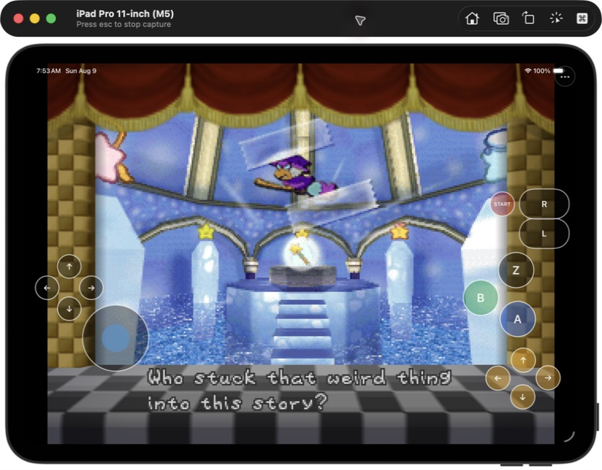
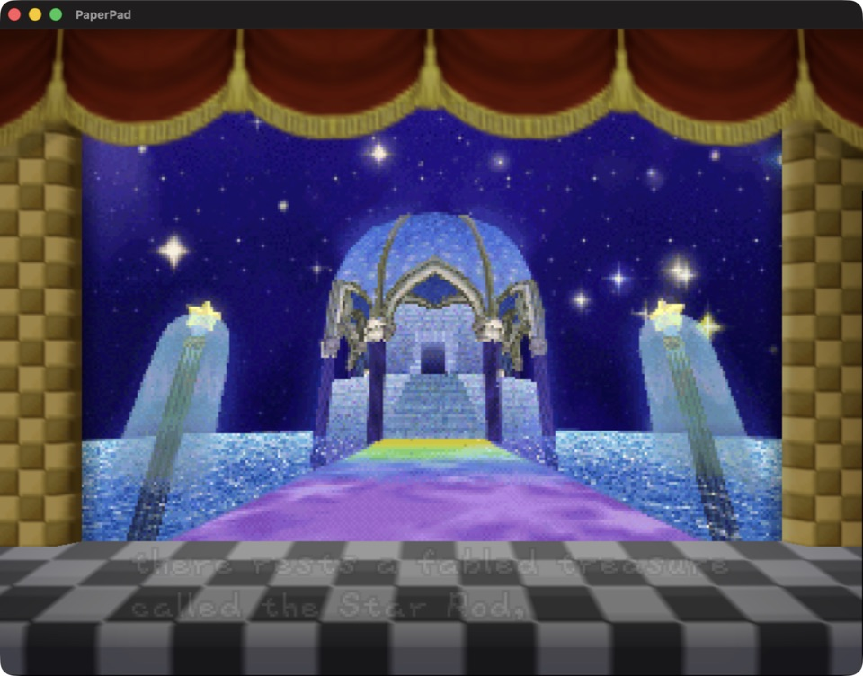
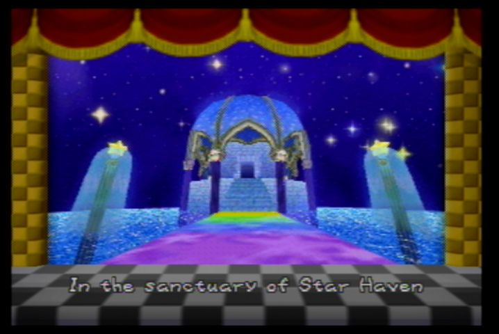
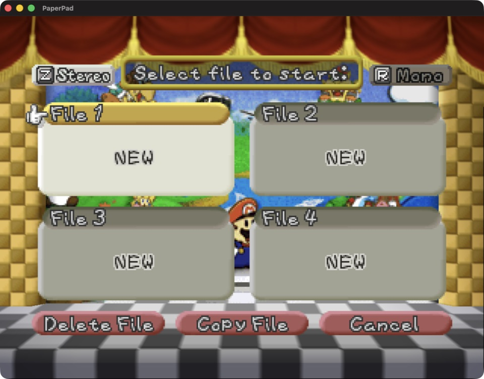
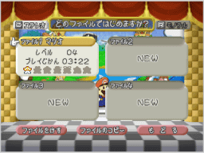
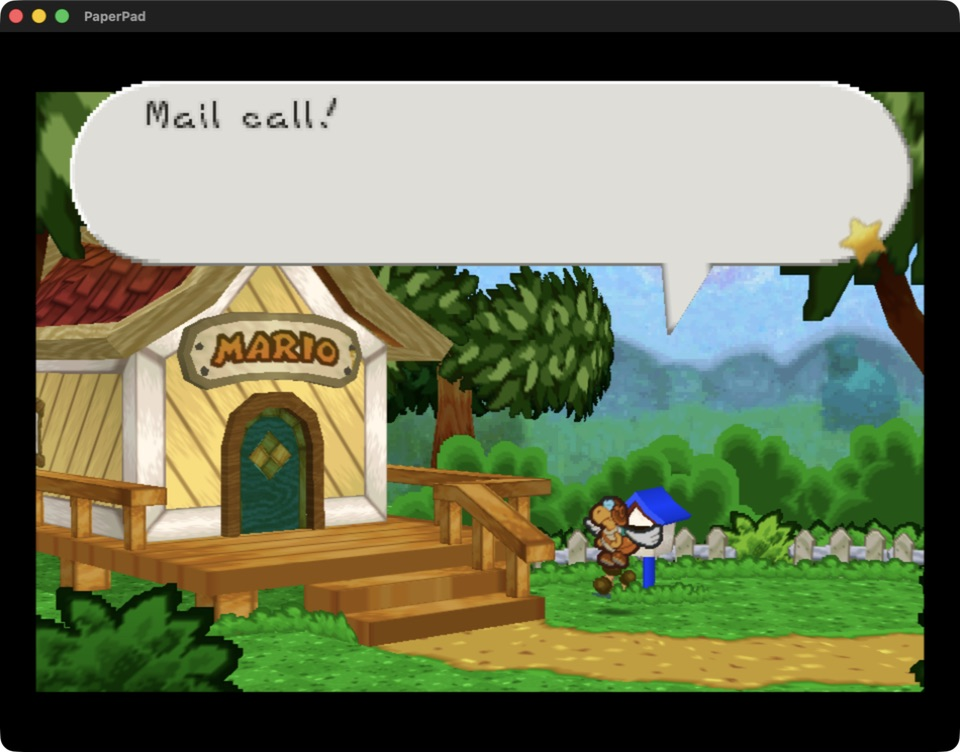
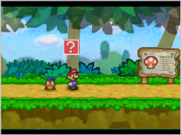

# PaperPad

<p align="center">
  <strong>Paper Mario recompiled for Apple Silicon, with a native Metal renderer and an iPhone/iPad touch interface.</strong>
</p>

<p align="center">
  
  
  
  
  
</p>



PaperPad combines the [pmret Paper Mario decompilation](https://github.com/pmret/papermario) with the statically recompiled runtime and renderer vendored by [Paper-Mario-ReCut](https://github.com/SMCGames/Paper-Mario-ReCut). It adds an Apple application shell, Metal presentation, keyboard/controller input, a safe-area-aware touch layout, native settings, and a private first-run ROM importer.

This repository contains integration source, patches, scripts, and documentation. It does **not** contain Paper Mario, a ROM, extracted Nintendo assets, generated playable game code, saves, or a playable ROM-derived archive. You must supply your own legally obtained supported game data locally. Read [RIGHTS_AND_LICENSES.md](RIGHTS_AND_LICENSES.md) before redistributing any source or binary.

## Availability

There are currently no signed, notarized, TestFlight, App Store, or prebuilt public downloads. The table describes source builds verified from this repository on 2026-08-09.

| Target | Status | Acceptance exercised |
|---|---|---|
| Apple Silicon macOS | **Verified source build** | Clean app build, launch, intro, file creation, and early gameplay |
| iPhone Simulator | **Verified source build** | First-run ROM flow, launch, native rendering, touch overlay, and settings |
| iPad Simulator | **Verified source build** | Title through file creation and Peach's Castle entry using touch controls; rotation and Retina framing |
| Physical iPhone/iPad | **Not yet verified** | No unsigned device build, signing flow, device install, or on-device playtest is published |
| TestFlight / App Store | **Not announced** | Distribution rights, signing, packaging, and store review remain outside the verified scope |

PaperPad is a release candidate for the two verified local targets, not a claim that every chapter or physical-device configuration has completed acceptance. See [docs/STATUS.md](docs/STATUS.md) and [docs/RELEASE_CHECKLIST.md](docs/RELEASE_CHECKLIST.md) for the exact boundary.

## Get started

### Requirements

- Apple Silicon Mac
- Xcode with the macOS and iOS Simulator SDKs
- CMake, Ninja, Git, jq, Python 3.11 or newer, Rust/Cargo, and Homebrew
- GNU `cpp-16` (`brew install gcc`); the setup script builds the required MIPS binutils if necessary
- A legally obtained, unmodified Paper Mario (US) 1.0 ROM in `.z64`, `.v64`, or `.n64` byte order
- Several gigabytes of free space for pinned sources, the decompilation build, generated AOT source, and build trees

The supported ROM normalizes to 40 MiB and SHA-1 `3837f44cda784b466c9a2d99df70d77c322b97a0`. That identifier validates compatibility; it is not a download hint.

### macOS

From the repository root:

```sh
scripts/build-macos-app.sh --rom /absolute/path/to/your/paper-mario-rom
open build-macos-release/PaperPad.app
```

The first command fetches exact source pins, applies maintained patches, validates and normalizes the ROM, builds the decompilation and host tools, generates local AOT source, builds PaperPad, and ad-hoc signs the ROM-free app. Generated input stays in ignored local directories.

After the first successful generation, an incremental rebuild can omit `--rom`:

```sh
scripts/build-macos-app.sh
```

The macOS app reads the private normalized ROM from the local generated workspace; it is not copied into `PaperPad.app`.

### iPhone or iPad Simulator

Build the Simulator app, boot exactly one Simulator, then install it:

```sh
scripts/build-ios-simulator.sh --rom /absolute/path/to/your/paper-mario-rom
xcrun simctl list devices available
xcrun simctl boot "iPad Pro 11-inch (M4)"
open -a Simulator
xcrun simctl install booted build-ios-simulator/Release/PaperPad.app
xcrun simctl launch booted com.chrissotraidis.paperpad
```

On first launch, choose your own ROM through the native document picker. PaperPad accepts the three standard N64 byte orders, verifies the exact revision, normalizes it, and stores the private copy in that simulated device's Application Support container. The built `.app` itself remains ROM-free.

To avoid ambiguous tests, shut down the active Simulator before testing another app or target:

```sh
xcrun simctl terminate booted com.chrissotraidis.paperpad || true
xcrun simctl shutdown booted
```

See [docs/BUILDING.md](docs/BUILDING.md) for clean-build details and troubleshooting.

## Controls

### macOS keyboard

| N64 input | Keyboard | N64 input | Keyboard |
|---|---|---|---|
| A | `Z` | B | `X` |
| Start | Return | Z | Left Shift |
| L / R | `Q` / `E` | Analog stick | Arrow keys |
| D-pad | `W` `A` `S` `D` | C-buttons | `I` `J` `K` `L` |

SDL-compatible controllers use the left stick, D-pad, face buttons, shoulders, left trigger for Z, and right stick for the C-buttons.

### iPhone and iPad touch

The overlay provides an analog stick, D-pad, A/B/Z, C-buttons, L/R, and Start. `PaperPad Menu` remains accessible above gameplay and opens:

- master volume;
- automatic or fixed 2x rendering resolution;
- original 4:3 or expanded aspect ratio;
- touch-control visibility and opacity;
- touch-layout editing and reset; and
- private ROM replacement/removal.

Touch visibility, opacity, layout, resolution, aspect ratio, and volume persist locally. The game remains framed at its original 4:3 aspect ratio by default.

## What works

- Static arm64 game code; no JIT or downloaded executable code on Apple targets
- Direct Metal rendering through the ReCut-vendored RT64 and N64ModernRuntime trees
- HLE NAUDIO processing through pinned `mupen64plus-rsp-hle`
- Keyboard and SDL controller input on macOS
- Multi-touch N64 controls, fixed visible stick, broad floating-stick pickup area, layout editing, opacity, and enable/disable controls on iPhone/iPad
- iPhone and iPad native-window support with Retina pixel sizing, safe-area layout, rotation recovery, and original-aspect framing
- Native first-run ROM selection, byte-order normalization, exact revision validation, private storage, and ROM management
- Flash save handling and clean RT64 worker teardown fixes maintained as source patches
- Ordered Apple shutdown: renderer/events/saves finish before a clean single-session process exit, avoiding parked guest-thread teardown races

## Current limits

- Physical iPhone/iPad installation, signing, audible device audio, interruption handling, thermal behavior, and long-session acceptance have not been verified.
- The current playtest covers the opening flow and early gameplay, not a complete game playthrough.
- Touch controls do not yet auto-hide when a hardware controller connects.
- The iOS launch log can report an unbalanced UIKit appearance-transition warning, and Simulator can report a duplicate accessibility-class warning. Neither blocked the verified session, but both remain cleanup items.
- RT64 logs `RenderPool in Metal is not implemented currently`; the tested rendering path continues without a crash.

Report a reproducible regression with the platform, device/OS, PaperPad commit, build command, expected and actual behavior, and non-sensitive logs. Never attach or request ROMs, extracted assets, saves, signing files, or credentials.

## Visual verification

PaperPad's presentation was checked against archived original-game captures for theater geometry, 4:3 composition, palette, curtain and checkerboard staging, text treatment, and early-game layering.

| PaperPad | Original reference |
|---|---|
|  |  |
|  |  |
|  |  |

Primary layout/color references: [Nintendo's archived file-select guide](https://www.nintendo.co.jp/wii/vc/vc_ms/vc_ms_03.html) and [Nintendo's archived early-game guide](https://www.nintendo.co.jp/wii/vc/vc_ms/vc_ms_01.html). The opening-scene comparison uses a secondary [Paper Mario LP capture](https://darkdata.rustedlogic.net/ran/File_Dump_SystemLogoff/Paper_Mario_LP/Prologue.html).

## Reproducibility and repository safety

`dependencies.lock.json` records every fetched source revision and the supported ROM fingerprint. `scripts/clone-sources.sh` checks out those exact revisions under ignored `ref/`, disables their push URLs, and `scripts/apply-patches.sh` applies the maintained patch series idempotently.

Before publishing source, run:

```sh
scripts/check-repo-safety.sh
git diff --check
```

The safety audit rejects game data, generated packages, signing material, likely credentials, tracked reference checkouts, and oversized files from both the current tree and publishable Git history. It also validates shell syntax, executable bits, and Git integrity.

## Project map

| Path | Purpose |
|---|---|
| `apple/app/` | UIKit lifecycle, setup/ROM manager, settings, touch UI, privacy manifest, and app metadata |
| `src/` | Native runner, input, renderer bridge, runtime hooks, paths, and generated-code integration |
| `config/` | N64Recomp configuration template |
| `patches/` | Ordered fixes for pinned ReCut, N64ModernRuntime, N64Recomp, and RT64 source |
| `scripts/` | Fetch, validate, generate, build, test-support, and repository-audit automation |
| `docs/` | Architecture, build, status, testing, dependency, issue, and release documentation |
| `ref/` | Ignored pinned source inputs; never published |
| `generated/` | Ignored ROM-derived/AOT build input; never published |

## Documentation

- [Architecture](docs/ARCHITECTURE.md)
- [Building](docs/BUILDING.md)
- [Current status](docs/STATUS.md)
- [Testing history](docs/TESTING.md)
- [Known issues](docs/KNOWN-ISSUES.md)
- [Dependency inventory](docs/DEPENDENCIES.md)
- [Repository inventory](docs/REPOSITORY-INVENTORY.md)
- [Release checklist](docs/RELEASE_CHECKLIST.md)
- [Contributing](CONTRIBUTING.md)
- [Security policy](SECURITY.md)
- [Rights and licensing boundary](RIGHTS_AND_LICENSES.md)

## Legal and acknowledgements

PaperPad is an independent, unofficial project and is not affiliated with or endorsed by Nintendo. Paper Mario and all related game names, characters, copyrights, and trademarks belong to their respective owners. pmret, SMCGames, N64Recomp/N64ModernRuntime, RT64, mupen64plus, SDL, zstd, and their contributors retain their own licenses and rights. See [RIGHTS_AND_LICENSES.md](RIGHTS_AND_LICENSES.md) and [docs/DEPENDENCIES.md](docs/DEPENDENCIES.md); neither is legal advice.
